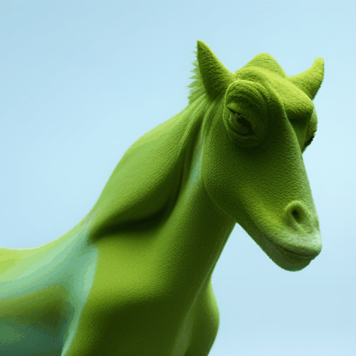
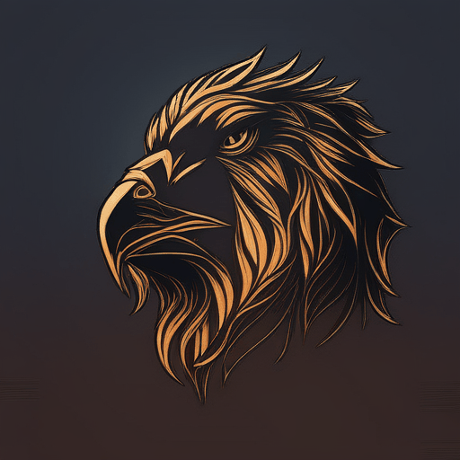
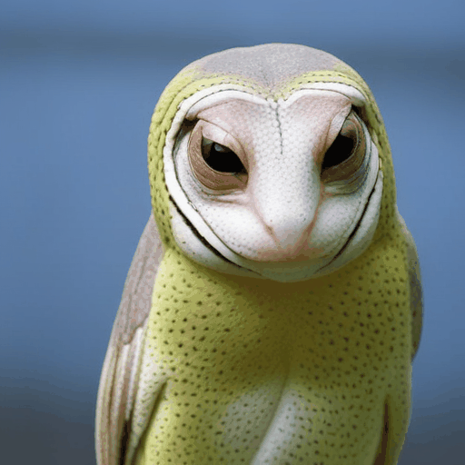

<div align="center">

<h1> Novel Object Synthesis via Adaptive Text-Image Harmony </h1>

Zeren Xiong<sup>1</sup> · Zedong Zhang<sup>1</sup> · Zikun Chen<sup>1</sup> · Shuo Chen<sup>2</sup> · 
Xiang Li<sup>3</sup> · Gan Sun<sup>4</sup> ·Jian Yang<sup>1</sup> · Jun Li<sup>1</sup>  

<sup>1</sup>Nanjing University of Science and Technology · <sup>2</sup>RIKEN· <sup>3</sup>Nankai University · <sup>4</sup>South China University of Technology · 

<a href="https://arxiv.org/abs/2410.20823"></a>
<a href="https://xzr52.github.io/ATIH/"></a> 
</div>

<table style="width: 100%; border-collapse: collapse; border: none; margin: 0; padding: 0;">
  <tr style="border: none;">
    <td style="border: none; padding: 0; width: 25%;">
      
    </td>
    <td style="border: none; padding: 0; width: 25%;">
      
    </td>
    <td style="border: none; padding: 0; width: 25%;">
      
    </td>
    <td style="border: none; padding: 0; width: 25%;">
      
    </td>
  </tr>
</table>


<div style="background-color: #1e1e1e; color: #d1d1d1; border-radius: 10px; padding: 20px; line-height: 1.6;">
  In this paper, we study an object synthesis task that combines an object text with an object image to create a new object image. However, most diffusion models struggle with this task, often generating an object that predominantly reflects either the text or the image due to an imbalance between their inputs.
  To address this issue, we propose a simple yet effective method called <strong>Adaptive Text-Image Harmony (ATIH)</strong> to generate novel and surprising objects. Our contributions include:
  <ul>
    <li>
      Introducing a scale factor and an injection step to balance text and image features in cross-attention, while preserving image information in self-attention during the text-image inversion diffusion process.
    </li>
    <li>
      Designing a balanced loss function with a noise parameter, ensuring both optimal editability and fidelity of the object image.
    </li>
    <li>
      Presenting a novel similarity score function that maximizes the similarities between the generated object image and the input text/image while balancing these similarities to harmonize text and image integration.
    </li>
  </ul>
</div>


## 🚀 **News**
- **2024.11.12**: 🎉 Our code is released! Explore the possibilities of novel object synthesis with our framework.


## 🛠️ **1. Set Environment**

To set up the environment for running the code, follow these steps:

1. Clone the repository:
    ```bash
    git clone https://github.com/xzr52/ATIH-code
    cd ATIH-code
    ```

2. Create a conda environment and install dependencies:
    ```bash
    conda create -n ATIH python=3.10
    conda activate ATIH
    pip install -r requirements.txt
    ```

3. Set CUDA paths:
    ```bash
    export CUDA_HOME=/usr/local/cuda
    ```

4. Install the required submodule:
    ```bash
    cd GroundingDino
    pip install -e .
    ```
<!-- git clone https://github.com/IDEA-Research/GroundingDINO.git -->
5. Download the segmentation model weights [seg_ckpts](https://drive.google.com/file/d/12TP528_6FfDRSeczkHuZbMDMG8flRgb6/view?usp=drive_link), unzip them, and place them in the ckpts/ folder.


## 🚀 **2. Quick Start**

We provide a Gradio-based application for an intuitive user interface to interact with the framework.Our code is designed to run on two GPUs, each with 24GB of memory, by default. If your single GPU has more than 30GB of memory, you can modify the code by setting device2 to the same as device1, allowing the program to run on a single GPU.

To launch the app locally:
```python
export no_proxy=127.0.0.1,localhost
python app.py
```
## 🖼️ **3. Inference One Image**
To perform inference on a single image, use the following command:
```python
python inference_one_image.py --image_path examples/rabbit.png --target_prompt 'cock'
```
- `--image_path`: Path to the input image.
- `--target_prompt`: Text description of the object.
## 🎨 **4. Complex Prompt Generation**
Our framework supports using complex prompts. Here's an example of how the results look:
```python
python inference_one_image.py --image_path examples/lion.png --target_prompt 'Green triceratops with rough, scaly skin and massive frilled head'
```
<p align="center">

  

</p>
</table>
</details>


# 🙌 Acknowledgment

This work was partially supported by the National Science Foundation of China under Grant Nos. 62072242 and 62361166670. We also thank the developers of the following projects, which our implementation builds upon:

- [MasaCtrl](https://github.com/TencentARC/MasaCtrl)  
- [Diffusers](https://github.com/huggingface/diffusers)  
- [ReNoise Inversion](https://github.com/garibida/ReNoise-Inversion)  
- [GroundingDINO](https://github.com/IDEA-Research/GroundingDINO)  
- [Grounded Segment Anything](https://github.com/IDEA-Research/Grounded-Segment-Anything)  
- [SDXL-Turbo](https://huggingface.co/stabilityai/sdxl-turbo)

We deeply appreciate their contributions , which have been instrumental to our work.


# 📖BibTeX
```
@inproceedings{
  xiong2024novel,
  title={Novel Object Synthesis via Adaptive Text-Image Harmony},
  author={Zeren Xiong and Ze-dong Zhang and Zikun Chen and Shuo Chen and Xiang Li and Gan Sun and Jian Yang and Jun Li},
  booktitle={The Thirty-eighth Annual Conference on Neural Information Processing Systems},
  year={2024},
  url={https://openreview.net/forum?id=ENLsNDfys0}
}
```


